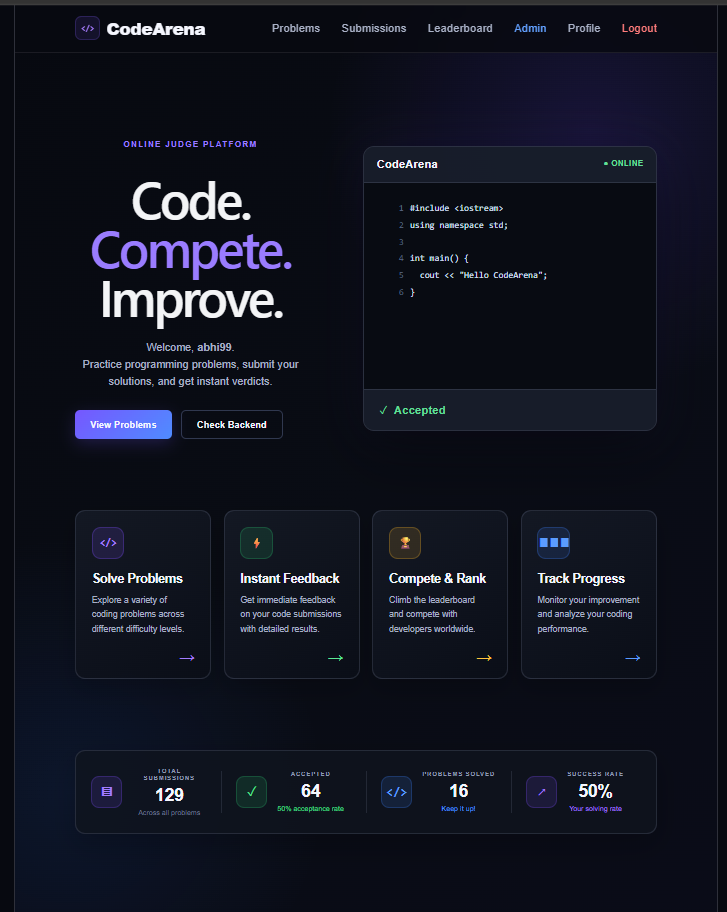
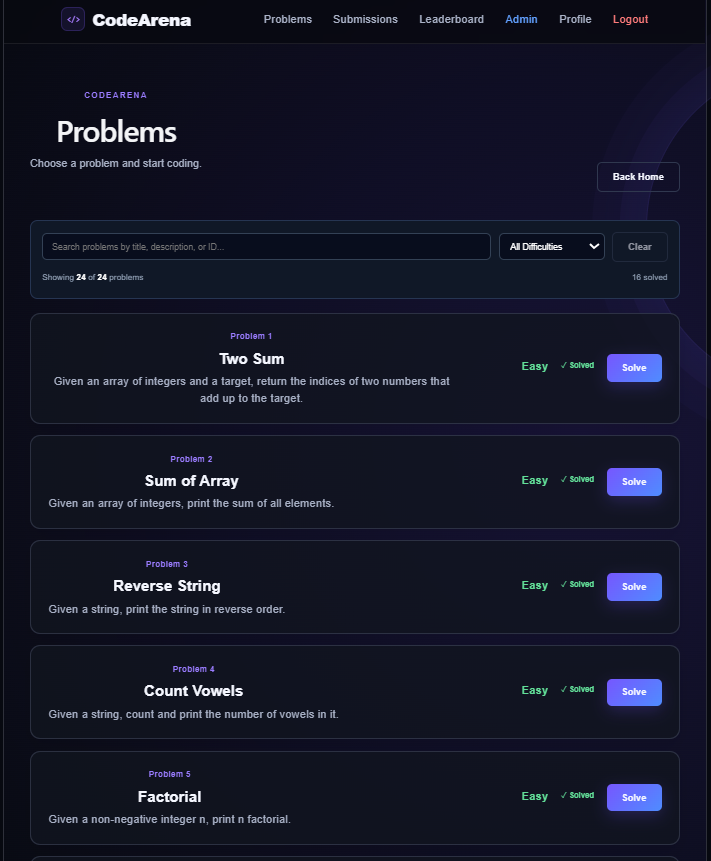
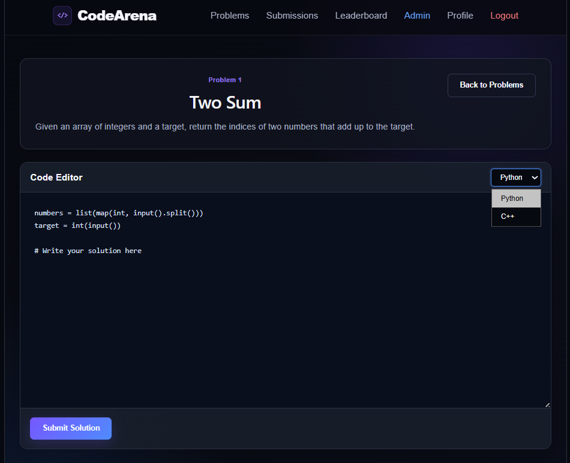
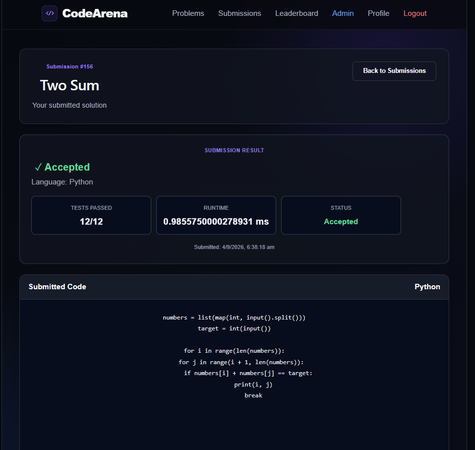
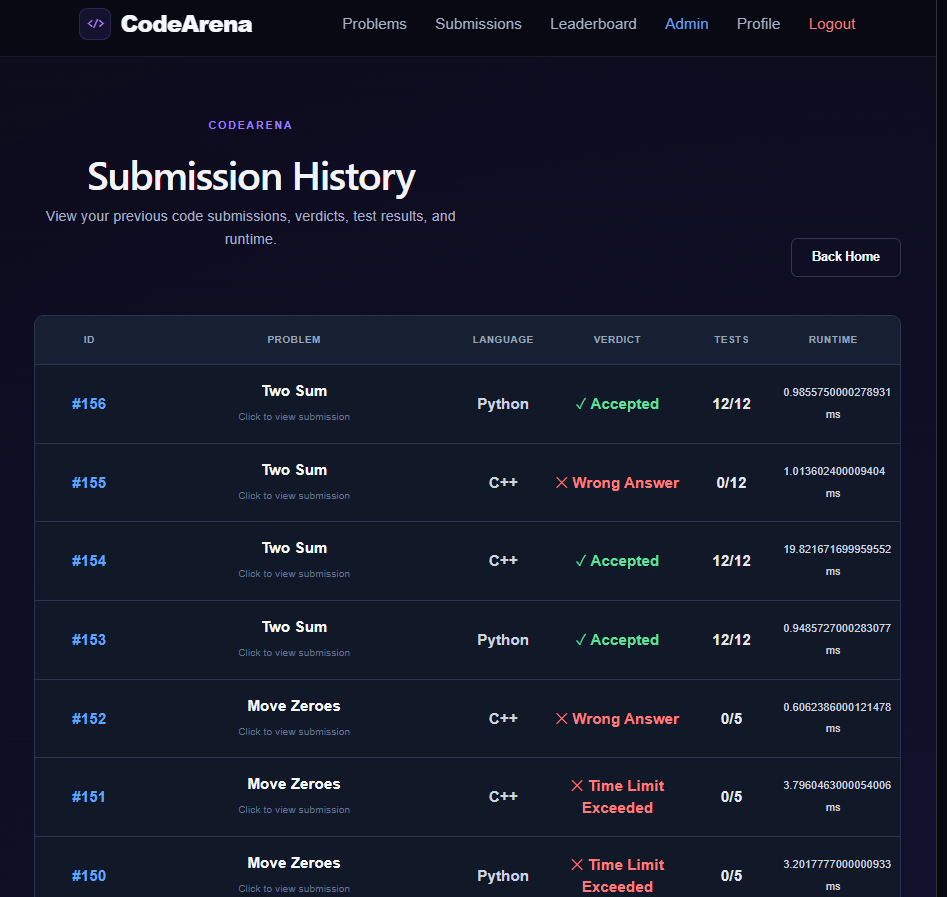
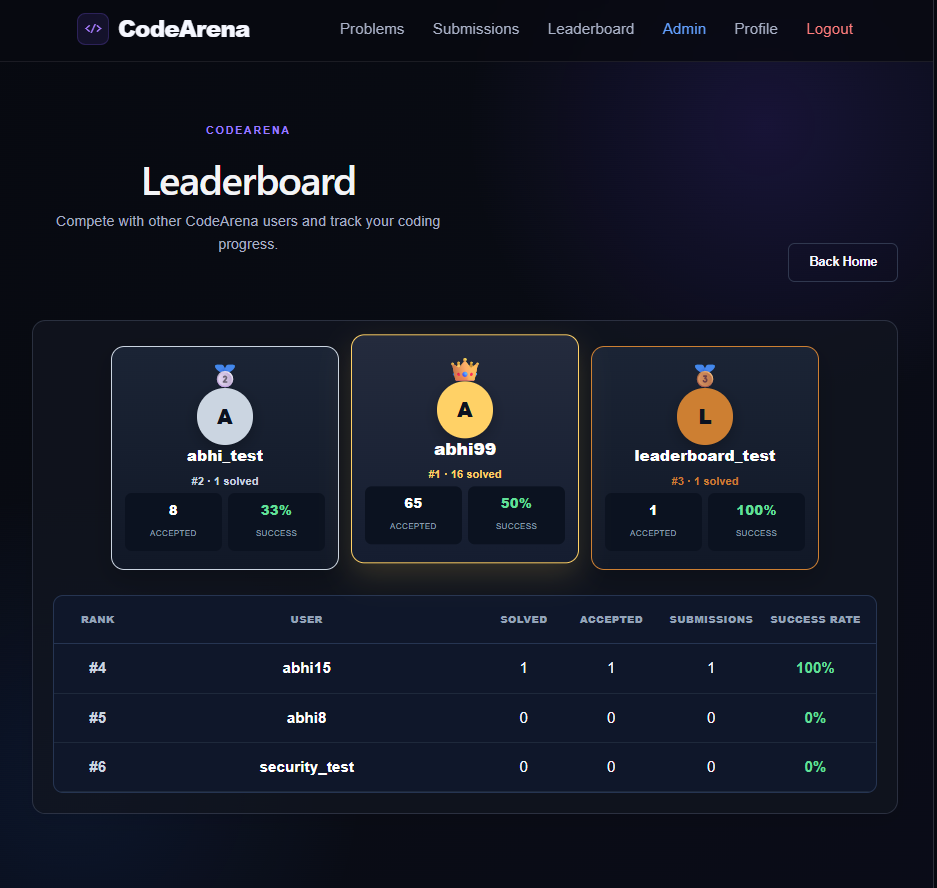

# CodeArena

> A full-stack online coding judge platform built with React, FastAPI, PostgreSQL, and a custom code execution engine.

CodeArena allows users to solve programming problems, submit solutions in C++17 or Python, receive automated verdicts, track submission history, view coding statistics, and compete on a global leaderboard.

---

## 🚀 Features

### 👤 Authentication & Account Management

- User registration and login
- JWT-based authentication
- Protected user functionality
- Password change
- Password reset through email
- Email verification
- User profile
- Coding statistics

### 💻 Online Coding Judge

- Browse coding problems
- Search problems
- Difficulty filtering
- C++17 support
- Python support
- Code submission and execution
- Automated test-case evaluation
- Accepted verdict
- Wrong Answer verdict
- Compilation Error detection
- Runtime Error detection
- Time Limit Exceeded detection
- Code size limits
- Input size limits
- Output size limits
- Temporary execution workspaces
- Automatic workspace cleanup

### 📊 Progress & Competition

- Submission history
- Problems solved tracking
- Success rate
- Verdict breakdown
- Coding statistics
- Global leaderboard
- User rankings

### 🛠️ Developer Features

- RESTful FastAPI backend
- PostgreSQL database
- SQLAlchemy ORM
- JWT authentication
- Swagger/OpenAPI documentation
- Environment-based frontend API configuration
- Automated executor test suite
- Docker configuration

---

## 📸 Screenshots

### 🏠 Homepage

The homepage provides an overview of CodeArena, the coding workflow, platform features, and user statistics.

---

### 📚 Problems

The Problems page allows users to search problems, filter by difficulty, view solved status, and start solving.

---

### 💻 Code Editor

The coding interface allows users to read the problem statement, write code, select a supported language, and submit solutions.

---

### ✅ Accepted Submission

After execution, CodeArena displays the submission verdict, programming language, passed test cases, runtime, and submitted code.

---

### 📜 Submission History

Users can review previous submissions, programming languages, verdicts, test results, and execution runtime.

---

### 🏆 Leaderboard

The leaderboard allows users to compare their coding progress and rankings with other users.

---

## 🏗️ System Architecture

    React Frontend
           |
           | REST API / JWT
           v
       FastAPI Backend
        /           \
       /             \
      v               v
PostgreSQL       Code Executor
 Database          /       \
                  /         \
             Python        C++17
                              |
                         g++ Compilation
                              |
                              v
                        Test Cases
                              |
                              v
                         Final Verdict
                              |
                              v
                         PostgreSQL

---

## 🔄 Submission Flow

    User
      |
      v
    Select Problem
      |
      v
    Write Code
      |
      v
    Submit Solution
      |
      v
    React Frontend
      |
      v
    FastAPI Backend
      |
      v
    Validate Submission
      |
      v
    Code Execution Engine
      |
      +----------------+
      |                |
      v                v
    Python           C++17
      |                |
      |           Compile with g++
      |                |
      +-------+--------+
              |
              v
        Run Test Cases
              |
              v
        Compare Output
              |
              v
        Generate Verdict
              |
              v
        Store Submission
              |
              v
        Return Result
              |
              v
        React Frontend

---

## ⚙️ Code Execution Engine

CodeArena includes a custom execution engine responsible for running submitted programs and evaluating them against configured test cases.

### Supported Languages

| Language | Execution |
|---|---|
| Python | Direct Python execution |
| C++17 | Compile using `g++`, then execute |

### Execution Pipeline

    Submitted Code
          |
          v
    Language Validation
          |
          v
    Create Temporary Workspace
          |
          +-------------------+
          |                   |
          v                   v
       Python               C++17
       Execute              Compile
          |                   |
          |              Compilation
          |               Successful?
          |                /       \
          |              No         Yes
          |              |           |
          |              v           v
          |         Compilation   Execute
          |            Error         |
          |                          |
          +------------+-------------+
                       |
                       v
                 Run Test Cases
                       |
                       v
                 Compare Output
                       |
                       v
                  Final Verdict
                       |
                       v
                 Store Submission

---

## ⏱️ Execution Controls

The executor implements several protections around submitted programs:

| Protection | Purpose |
|---|---|
| Time Limit | Prevents programs from running indefinitely |
| Code Size Limit | Restricts excessively large source submissions |
| Input Size Limit | Restricts excessively large test inputs |
| Output Size Limit | Restricts excessive program output |
| Temporary Workspace | Provides a temporary directory for execution |
| Workspace Cleanup | Removes temporary execution files |

The executor also handles:

- Compilation failures
- Runtime failures
- Process timeouts
- Unsupported languages
- Invalid submissions

> **Security Note:** The current executor is designed for this project and portfolio environment. A production online judge executing arbitrary untrusted code at Internet scale would require stronger isolation such as containers or dedicated sandboxes, CPU and memory quotas, network restrictions, and isolated execution workers.

---

## 🧾 Submission Verdicts

| Verdict | Meaning |
|---|---|
| Accepted | Solution passed all configured test cases |
| Wrong Answer | Program output did not match the expected output |
| Compilation Error | C++ program failed during compilation |
| Runtime Error | Program terminated with an execution error |
| Time Limit Exceeded | Program exceeded the configured execution time |

---

## 🔐 Authentication

CodeArena uses JWT-based authentication to provide protected user functionality.

Authentication-related functionality includes:

- User registration
- User login
- JWT authentication
- Protected API endpoints
- Password change
- Password reset
- Email verification
- User-specific submissions
- User-specific statistics

---

## 🔑 Password Reset

Users can request a password reset through their registered email address.

    User Requests Password Reset
              |
              v
    Backend Generates Reset Token
              |
              v
    Reset Email Sent
              |
              v
    User Opens Reset Link
              |
              v
    New Password Submitted
              |
              v
    Password Updated

---

## ✉️ Email Verification

CodeArena supports email verification for account-related operations and email changes.

This provides an additional verification step for important account actions.

---

## 📚 Problem System

The problem system allows users to:

- Browse coding problems
- Search problems
- Filter by difficulty
- View problem statements
- View examples
- View constraints
- Check solved status
- Open the code editor
- Submit solutions

Each problem can contain the information required by the execution engine to evaluate submitted solutions.

---

## 🧪 Test Case Evaluation

Problems can contain multiple test cases.

Submitted solutions are executed against the configured test cases and the executor determines the final verdict.

The system tracks information such as:

- Passed test cases
- Failed test cases
- Execution runtime
- Final verdict

---

## 📜 Submission History

Users can review their previous submissions.

Submission history can provide information such as:

- Problem
- Programming language
- Verdict
- Passed test cases
- Execution runtime
- Submitted code
- Submission time

This allows users to track their attempts and review previous solutions.

---

## 📊 Statistics

CodeArena provides coding statistics to help users track their progress.

Statistics include:

- Problems solved
- Total submissions
- Successful submissions
- Success rate
- Verdict breakdown
- Coding activity

---

## 🏆 Leaderboard

CodeArena includes a global leaderboard that allows users to compare their coding activity and solved-problem progress with other users.

---

## 🌐 REST API

The backend exposes RESTful API endpoints using FastAPI.

The API handles functionality related to:

- Authentication
- User management
- Problems
- Test cases
- Submissions
- Code execution
- Statistics
- Leaderboard
- Password reset
- Email verification

The React frontend communicates with the backend through HTTP requests.

---

## 📖 Swagger / OpenAPI

FastAPI automatically provides interactive API documentation through Swagger/OpenAPI.

When running locally:

    http://127.0.0.1:8000/docs

Swagger can be used to inspect and test the available backend endpoints.

---

## 🗄️ Database

CodeArena uses PostgreSQL for persistent application data.

SQLAlchemy is used as the ORM layer between the FastAPI backend and PostgreSQL.

The database stores application information related to:

- Users
- Problems
- Test cases
- Submissions
- Authentication-related data
- User statistics

---

## 🔗 Database Relationships

The main application relationships can be represented as:

    User
      |
      +----------------+
      |                |
      v                v
    Submissions     Statistics
      |
      v
    Problem
      |
      v
    Test Cases

A user can have multiple submissions.

A problem can contain multiple test cases.

Submissions connect users with the problems they attempt.

---

## 🎨 Frontend Architecture

The frontend is built using React and Vite.

The frontend provides:

- Authentication screens
- Homepage
- Problem browser
- Problem solving interface
- Code editor
- Submission results
- Submission history
- Statistics
- Leaderboard
- User profile

The frontend communicates with the backend through REST APIs.

---

## 🧠 Backend Architecture

The backend is responsible for authentication, API handling, database operations, application logic, and code execution.

    FastAPI
       |
       +-- Authentication
       |
       +-- User Management
       |
       +-- Problem Management
       |
       +-- Submission Management
       |
       +-- Statistics
       |
       +-- Leaderboard
       |
       +-- Password Reset
       |
       +-- Email Verification
       |
       +-- Code Execution
                |
                +-- Python
                |
                +-- C++17

---

## 📡 Frontend / Backend Communication

CodeArena follows a client-server architecture.

    React Frontend
          |
          | HTTP Requests
          v
    FastAPI REST API
          |
          +--------------> PostgreSQL
          |
          +--------------> Code Executor

The frontend API base URL can be configured using:

    VITE_API_BASE_URL=http://127.0.0.1:8000

---

## 📁 Project Structure

    CodeArena/
    |
    +-- backend/
    |   +-- main.py
    |   +-- test_executor.py
    |   +-- Dockerfile
    |   +-- .dockerignore
    |   +-- requirements.txt
    |
    +-- frontend/
    |   +-- src/
    |   +-- public/
    |   +-- package.json
    |   +-- vite.config.js
    |   +-- .env.example
    |
    +-- docs/
    |   +-- screenshots/
    |       +-- 01-homepage.png
    |       +-- 02-problems.png
    |       +-- 03-code-editor.png
    |       +-- 04-accepted-submission.png
    |       +-- 05-submission-history.png
    |       +-- 06-leaderboard.png
    |
    +-- .gitignore
    +-- README.md

---

## 🛠️ Technology Stack

### Frontend

- React
- Vite
- JavaScript
- HTML
- CSS

### Backend

- Python
- FastAPI
- SQLAlchemy
- JWT authentication
- REST APIs

### Database

- PostgreSQL

### Code Execution

- Python
- C++17
- g++
- Subprocess execution

### Development Tools

- Git
- GitHub
- VS Code
- Swagger/OpenAPI
- Docker

---

## 🚀 Local Development Setup

### Prerequisites

Install the following:

- Node.js
- npm
- Python 3
- PostgreSQL
- Git
- C++ compiler with `g++`

### Backend Setup

Open a terminal:

    cd backend

Create a virtual environment:

    python -m venv venv

Activate it on Windows PowerShell:

    .\venv\Scripts\Activate.ps1

Install dependencies:

    pip install -r requirements.txt

Configure the required backend environment variables.

Start the backend:

    python -m uvicorn main:app --reload

Backend:

    http://127.0.0.1:8000

Swagger:

    http://127.0.0.1:8000/docs

### Frontend Setup

Open another terminal:

    cd frontend

Install dependencies:

    npm install

Start the development server:

    npm run dev

Frontend:

    http://localhost:5173

---

## 🔐 Environment Variables

Do not commit private credentials or secrets to GitHub.

### Frontend

The repository includes:

    frontend/.env.example

Example:

    VITE_API_BASE_URL=http://127.0.0.1:8000

### Backend

Backend environment variables contain local configuration such as:

- Database connection
- Secret key
- Email configuration
- Application settings

Sensitive `.env` files should remain local and are excluded from version control.

---

## 🧪 Testing

CodeArena includes an automated executor test suite covering important execution scenarios.

Run:

    cd backend
    python test_executor.py

The test suite covers:

1. Python correct execution
2. C++ correct execution
3. Python runtime error
4. C++ compilation error
5. Python time limit
6. C++ time limit
7. Output size limit
8. Code size limit
9. Input size limit
10. Unsupported language
11. Python input handling
12. C++ input handling

### Current Result

    12/12 tests passed

---

## 🧪 Additional Verification

### Backend Syntax Check

    cd backend
    python -m py_compile main.py

### Frontend Production Build

    cd frontend
    npm run build

---

## 🐳 Docker Configuration

Docker configuration is included for future containerized environments and deployment.

Backend Docker files:

    backend/Dockerfile
    backend/.dockerignore

The Docker configuration prepares the backend environment and includes the tools required for C++17 compilation.

Docker deployment is not required for local development.

---

## 🔒 Security Considerations

CodeArena includes several security-oriented practices:

- JWT-based authentication
- Protected backend endpoints
- Environment-based secrets
- `.env` excluded from Git
- Input validation
- Code size limits
- Input size limits
- Output size limits
- Process timeouts
- Temporary execution workspaces
- Automatic workspace cleanup

### Production Security

The current executor is a project-level implementation and should not be considered a complete security sandbox for arbitrary Internet-scale untrusted code execution.

A production-grade online judge would require additional isolation such as:

- Containerized execution
- Dedicated sandbox environments
- CPU quotas
- Memory quotas
- Network isolation
- Filesystem restrictions
- Resource monitoring
- Isolated worker infrastructure

---

## 🧩 Engineering Challenges

### 1. User Code Execution

Submitted programs require controlled execution.

The executor handles:

- Process creation
- Compilation
- Program execution
- Timeouts
- Error capture
- Output capture
- Temporary file management
- Cleanup

### 2. Multi-Language Support

Different execution paths are used for Python and C++17.

    Python
      |
      +-- Direct execution

    C++17
      |
      +-- Compile using g++
      |
      +-- Execute compiled program

### 3. Failure Handling

The executor handles multiple failure scenarios:

- Compilation errors
- Runtime errors
- Timeouts
- Excessive output
- Excessive input
- Excessively large source code
- Unsupported languages

### 4. Full-Stack Integration

The project connects the complete flow:

    React
      |
      v
    REST API
      |
      v
    FastAPI
      |
      v
    SQLAlchemy
      |
      v
    PostgreSQL

    FastAPI
      |
      v
    Code Executor
      |
      v
    Verdict
      |
      v
    PostgreSQL
      |
      v
    React

---

## 💡 Design Decisions

### Why React?

React provides a component-based frontend architecture suitable for building an interactive coding platform.

### Why FastAPI?

FastAPI provides:

- Request validation
- REST API development
- Python ecosystem integration
- Automatic OpenAPI documentation
- High-performance API handling

### Why PostgreSQL?

PostgreSQL provides reliable relational storage for users, problems, test cases, submissions, and statistics.

### Why SQLAlchemy?

SQLAlchemy provides an ORM abstraction that simplifies database operations from Python.

### Why a Custom Executor?

A custom executor provides control over:

- Supported languages
- Compilation
- Execution
- Timeouts
- Output handling
- Test-case evaluation
- Verdict generation

---

## 🔄 Complete Application Data Flow

    USER
      |
      v
    React / UI
      |
      v
    REST API / FastAPI
      |
      +---------------------+
      |                     |
      v                     v
    PostgreSQL          Code Executor
                              |
                         +----+----+
                         |         |
                         v         v
                      Python     C++17
                         |         |
                         +----+----+
                              |
                              v
                       Test Case Results
                              |
                              v
                         Final Verdict
                              |
                              v
                         PostgreSQL
                              |
                              v
                            React
                              |
                              v
                             USER

---

## 🏛️ Application Layers

CodeArena follows a layered application architecture:

    Presentation Layer
            |
            v
    React Frontend
            |
            v
    API Layer
            |
            v
    FastAPI Backend
            |
            +--------------> Authentication
            |
            +--------------> Application Logic
            |
            +--------------> Code Executor
            |
            v
    Data Layer
            |
            v
    SQLAlchemy / PostgreSQL

---

## 🎯 Project Goals

CodeArena was built to demonstrate practical software engineering concepts including:

- Full-stack development
- Backend engineering
- Database design
- REST API development
- Authentication
- Process management
- Code execution
- Error handling
- Automated testing
- Software architecture
- Git/GitHub workflow

---

## 🔮 Future Improvements

Potential future improvements include:

- Stronger container-based sandboxing
- Memory limits
- CPU resource quotas
- Network isolation
- Queue-based execution workers
- Redis-based job queues
- Horizontal scaling
- Real-time submission status
- Admin problem management
- Additional programming languages
- Advanced leaderboard scoring
- Contest mode
- Plagiarism detection
- Detailed performance analytics
- Cloud deployment
- CI/CD pipeline
- Monitoring and logging infrastructure

---

## 📌 Current Project Status

| Component | Status |
|---|---|
| React Frontend | ✅ Complete |
| FastAPI Backend | ✅ Complete |
| PostgreSQL Integration | ✅ Complete |
| Authentication | ✅ Complete |
| Problem System | ✅ Complete |
| C++17 Execution | ✅ Complete |
| Python Execution | ✅ Complete |
| Test Case Evaluation | ✅ Complete |
| Submission History | ✅ Complete |
| Statistics | ✅ Complete |
| Leaderboard | ✅ Complete |
| Password Reset | ✅ Complete |
| Email Verification | ✅ Complete |
| Swagger/OpenAPI | ✅ Complete |
| Executor Test Suite | ✅ 12/12 Passed |
| Docker Configuration | ✅ Included |
| Documentation | ✅ Complete |

---

## 💼 Why CodeArena Is a Strong Software Engineering Project

CodeArena combines several areas of software engineering into one application.

### Full-Stack Engineering

React frontend connected to a FastAPI backend and PostgreSQL database.

### Backend Engineering

The backend handles:

- Authentication
- Validation
- Database operations
- Application logic
- Code execution
- Error handling
- API responses

### Systems Concepts

The execution engine demonstrates:

- Process management
- Compilation
- Subprocess execution
- Timeouts
- Input/output handling
- Temporary filesystem management

### Database Engineering

The project uses a relational database to persist users, problems, test cases, submissions, and statistics.

### Testing

The executor includes automated tests covering both successful execution and failure scenarios.

---

## 🧠 Project Overview

> CodeArena is a full-stack online coding judge built using React, FastAPI, PostgreSQL, SQLAlchemy, and a custom execution engine. Users can solve programming problems and submit solutions in C++17 or Python. The FastAPI backend authenticates users, stores application data and submissions in PostgreSQL, and sends submitted code to the execution engine. C++17 submissions are compiled using g++, while Python submissions are executed directly. The executor applies time and size limits, captures compilation and runtime errors, evaluates test cases, generates a verdict, and stores the submission result. I also implemented authentication, password reset, email verification, submission history, statistics, leaderboard functionality, Swagger documentation, and automated executor tests.

---

## 🧠 Key Engineering Concepts Demonstrated

- Full-stack application architecture
- REST API design
- JWT authentication
- Relational database design
- ORM usage
- Process execution
- Compilation pipelines
- Error handling
- Timeout management
- Input/output validation
- Temporary filesystem management
- Automated testing
- Environment configuration
- API documentation
- Git version control
- Docker configuration
- Production architecture considerations

---

## 🏭 Production Architecture

For a production-scale online judge, execution workloads could be separated from the main API servers.

    Load Balancer
         |
         +-------------------+
         |                   |
         v                   v
    API Server          API Server
         |                   |
         +---------+---------+
                   |
                   v
               Job Queue
                   |
         +---------+---------+
         |         |         |
         v         v         v
      Worker 1  Worker 2  Worker 3
         |         |         |
         v         v         v
      Sandbox   Sandbox   Sandbox
         |         |         |
         +---------+---------+
                   |
                   v
              PostgreSQL

This architecture would allow code execution workloads to be isolated and scaled independently from the API servers.

---

## 📚 Learning Outcomes

Building CodeArena provided practical experience with:

- React application development
- FastAPI backend development
- PostgreSQL
- SQLAlchemy
- Authentication systems
- REST APIs
- Code execution systems
- Process management
- Automated testing
- Git/GitHub
- Application architecture
- Security considerations
- Deployment architecture

---

## ⭐ Project Highlights

- Full-stack React + FastAPI application
- PostgreSQL database
- JWT authentication
- C++17 + Python execution
- Automated test-case evaluation
- Submission history
- Statistics dashboard
- Global leaderboard
- Password reset
- Email verification
- Swagger/OpenAPI documentation
- Execution limits
- Automated executor tests
- Docker configuration
- Production architecture considerations

---

## 🌐 Local URLs

### Frontend

    http://localhost:5173

### Backend

    http://127.0.0.1:8000

### Swagger API Documentation

    http://127.0.0.1:8000/docs

---

## 🔗 Repository

GitHub:

https://github.com/abhiram-naik/CodeArena

---

## 👨‍💻 Author

**Abhiram Naik**

CodeArena was built as a full-stack software engineering project focused on backend systems, APIs, databases, authentication, code execution, testing, and application architecture.

---

## 📄 License

This project is available for educational and portfolio purposes.

---

## 🏁 Final Note

CodeArena combines frontend development, backend engineering, databases, authentication, APIs, process execution, testing, and software architecture into one complete application.

The project demonstrates how a coding platform can be designed from the user interface through the backend execution engine and database layer.

**Code. Compete. Improve.**